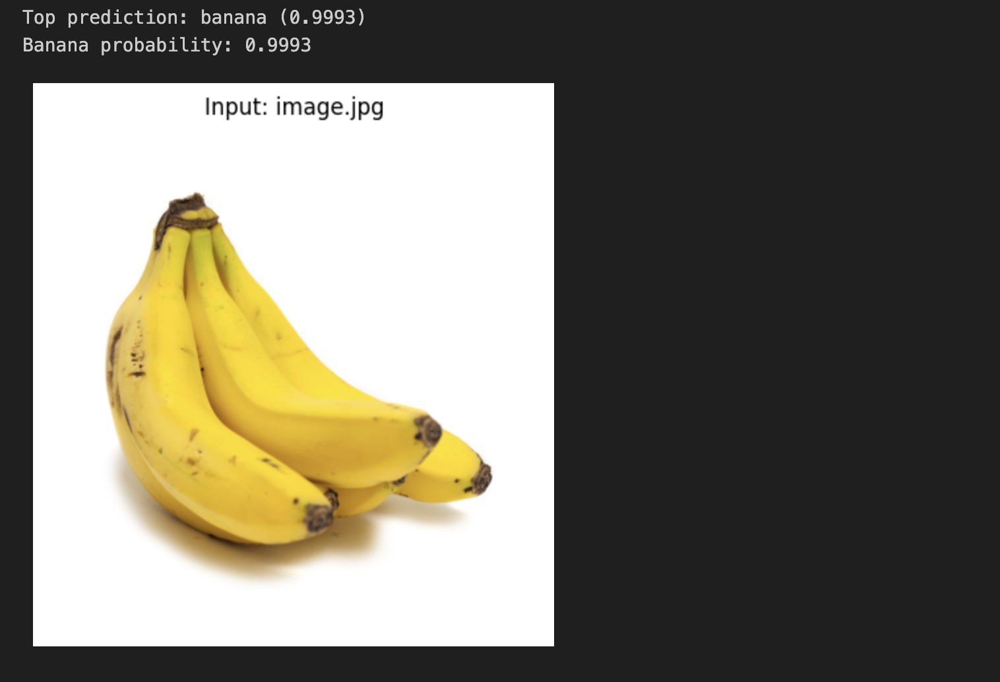
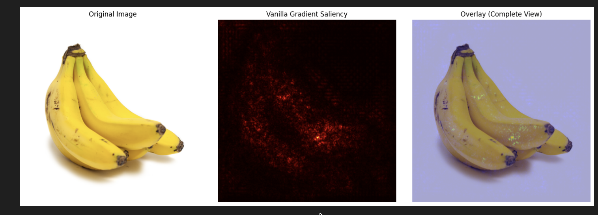
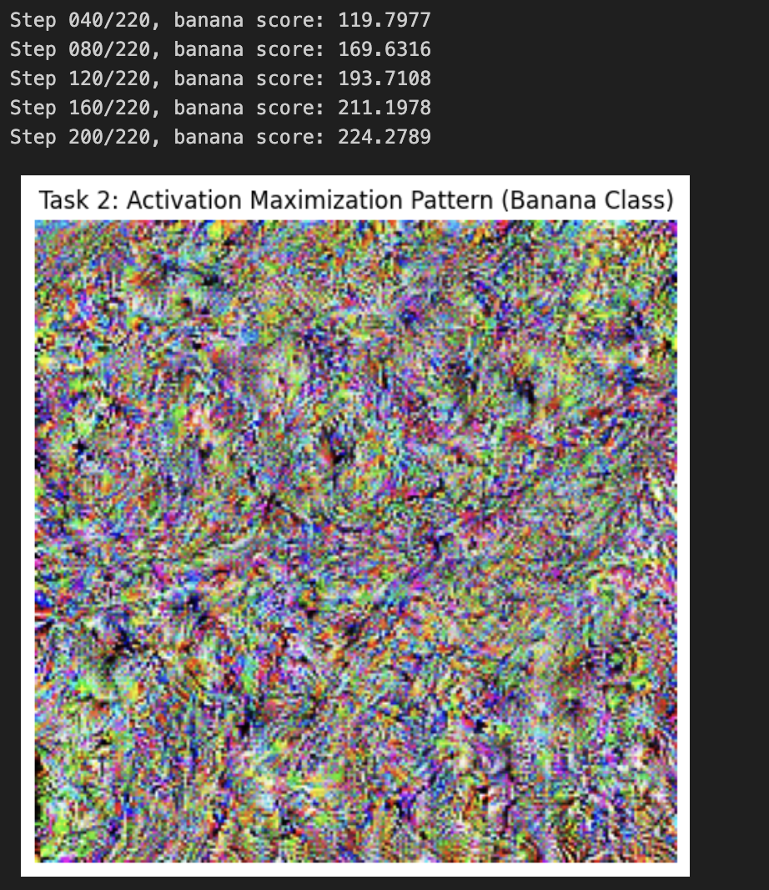

# Explainable AI (XAI): The Banana Problem

**Name:** ANIRUDDHA K S  
**SRN:** PES1UG23AM905  
*AIML-A section*
20-03-2026

---

## 1. Project Overview
This assignment demonstrates the application of Explainable AI (XAI) techniques to deep learning models. Specifically, we use a pre-trained **ResNet18** model to explore how convolutional neural networks classify images of a banana, utilizing two distinct XAI methodologies.

### Executed Tasks
*   **Method 1:** Vanilla Gradient Saliency Map generation for the banana class.
*   **Method 2:** Activation Maximization specifically targeting the banana neuron.

---

## 2. Methodology & task Breakdown

### 2.1 Task 1: Vanilla Gradient Saliency Map
**Primary Goal:** To identify and visualize the critical pixels within an input image that most significantly drive the model to predict the "banana" class.

**Approach Taken:**
1.  Initialize a ResNet18 model pre-trained on ImageNet.
2.  Import an input image of a banana.
3.  Calculate the gradients of the banana class activation concerning the individual input pixels.
4.  Render the resulting saliency map by taking the maximum absolute gradient across the RGB channels.

**Visual Outputs:**

*Original Image Used:*  

*Resulting Saliency Visualization:*  

---

### 2.2 Task 2: Activation Maximization
**Primary Goal:** To synthesize a completely new image from scratch (noise) that strongly activates the target banana class neuron within the ResNet18 architecture.

**Approach Taken:**
1.  Initialize a heavily randomized noise tensor.
2.  Employ gradient ascent to iteratively optimize the image, maximizing the confidence score for the banana class.
3.  Inject L2 and Total Variation (TV) regularization to ensure the generation of decipherable, less noisy visual textures.

**Visual Outputs:**

*Synthesized Banana Pattern:*  

---

## 3. Checklist of Requirements

| Core Requirement | Implementation Details |
| :--- | :--- |
| **Model Loading** | Utilized `ResNet18_Weights.IMAGENET1K_V1` |
| **Image Loading** | Loaded `image.jpg` / `input_banana.png` via the `PIL` library |
| **Saliency Computation** | Applied `.backward()` on the banana class raw score |
| **Map Visualization** | Displayed a 3-subplot layout inclusive of an overlay |
| **Highlighting Comments** | Added interpretation/analysis notes inside cell 5 |
| **Generative Ascent** | Used the `Adam` optimizer applied over random baseline noise |
| **Pattern Visualization** | Showed the optimized tensor converted to an image |

---

## 4. Specific Technical Parameters

### Model Configuration
*   **Network:** ResNet18
*   **Training Dataset:** ImageNet (1000 distinct classes)
*   **Target Class Index (Banana):** 954

### Regularization & Optimization (Method 2)
*   **Total Steps Executed:** 220
*   **Assigned Learning Rate:** 0.08
*   **L2 Penalty (λ):** 1e-4
*   **Total Variation Penalty (λ):** 1e-5